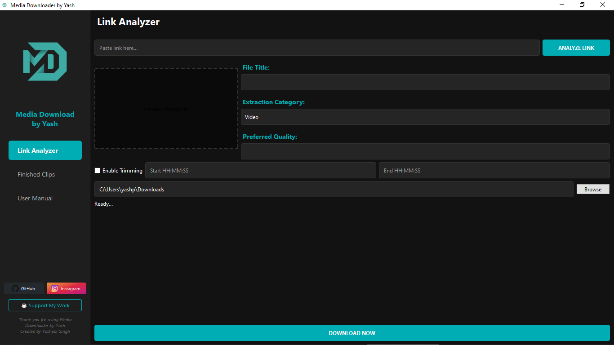

  
  <h1>Media Downloader by Yash</h1>
  

    <strong>Media Downloader Pro</strong> is a high-performance, professional-grade media extraction tool designed for power users who demand the highest quality content. Unlike standard downloaders that limit you to 360p or low-bitrate audio, this app unlocks the full potential of your media links, allowing for seamless extraction of <strong>4K and 8K Ultra-HD video</strong> and high-fidelity <strong>320kbps audio</strong>.
  

  

    Powered by a sharded parallel download engine and integrated with FFmpeg for precise trimming, it serves as a centralized hub for archiving content from over <strong>1,000+ websites</strong> with zero quality loss.
  

<h2>📥 Download Standalone</h2>

For users who don't want to install Python, you can download the latest pre-compiled version for Windows:

<ul>
  <li>
    <strong><a href="https://github.com/yashpalsinghsarangdevot/Media-Downloader-by-Yash/releases/latest">Download .exe (Portable)</a></strong> - Single file, just run it.
  </li>
  <li>
    <strong><a href="https://github.com/yashpalsinghsarangdevot/Media-Downloader-by-Yash/releases/latest">Download .zip (Full Package)</a></strong> - Recommended if the portable version has issues.
  </li>
</ul>

<h2>🛠️ How to Use</h2>
<ol>
  <li><strong>Analyze Link:</strong> Paste any supported media URL (YouTube, Instagram, etc.) and click <strong>ANALYZE LINK</strong>.</li>
  <li><strong>Select Quality:</strong> Once analyzed, pick your preferred resolution or bitrate from the dropdown menu.</li>
  <li><strong>Choose Category:</strong> Select <strong>Video</strong> (full clip), <strong>Audio Only</strong> (music), or <strong>Video-Only</strong>.</li>
  <li><strong>Trimming (Optional):</strong> Check "Enable Trimming" and enter your desired segment times.</li>
  <li><strong>Extract:</strong> Click <strong>DOWNLOAD NOW</strong> to start the process.</li>
  <li><strong>Track:</strong> Monitor progress in real-time on the main page, and view your completed files in the <strong>Finished Clips</strong> tab.</li>
</ol>

<h2>📸 UI Preview</h2>

  

<h2>📖 Detailed Description</h2>

  <strong>Media Downloader by Yash</strong> is an advanced multimedia tool designed to bridge the gap between complex command-line extraction utilities and the need for a streamlined, user-friendly desktop experience. Built on the industry-leading foundations of <code>yt-dlp</code> and <code>FFmpeg</code>, this application provides a robust environment for capturing, processing, and organizing digital content from over 1,000+ supported platforms.

  In an era where digital content is fragmented across numerous services, this tool serves as a centralized hub for content creators, researchers, and media enthusiasts. It doesn't just "download" files; it intelligently analyzes media streams to provide the highest possible quality while offering granular control over the final output. Whether you are archiving high-resolution 4K video, extracting high-fidelity 320kbps audio for production, or precisely trimming a specific segment from a massive livestream, the engine handles the technical heavy lifting in the background.

<h3>Technical Excellence & Architecture</h3>

The core of the application is built using a multi-threaded architecture in Python and PyQt6, ensuring that the user interface remains responsive even during heavy network operations.

<ul>
  <li>
    <strong>Intelligent Stream Selection:</strong> Unlike basic downloaders, this tool utilizes a complex scoring system to automatically select the best video and audio streams, ensuring maximum compatibility with MP4/M4A containers.
  </li>
  <li>
    <strong>Precision Engineering:</strong> The segment trimming feature utilizes FFmpeg's keyframe-aware cutting, allowing users to extract exact moments from long-form content without the need for external editing software.
  </li>
  <li>
    <strong>Bot Bypass & Resilience:</strong> To combat aggressive bot detection on platforms like YouTube, the tool implements advanced network strategies, including IPv4 forcing (to bypass IPv6 subnet bans), user-agent rotation, and support for authenticated cookie sessions.
  </li>
</ul>

<h2>🚀 Key Features</h2>

<h3>🎞️ Ultra-HD Video Extraction</h3>
<ul>
  <li><strong>No Resolution Limits:</strong> Download in 4K (2160p), 1440p, 1080p, and more.</li>
  <li><strong>Smart Containers:</strong> Automatically selects the best format (MKV or MP4) to preserve original quality.</li>
  <li><strong>Video-Only Mode:</strong> Extract high-res visuals without audio for professional video editing.</li>
</ul>

<h3>🎵 High-Fidelity Audio</h3>
<ul>
  <li><strong>Pure Sound:</strong> Extract audio-only tracks at the highest available bitrate (up to 320kbps).</li>
  <li><strong>Dynamic Selection:</strong> Choose from multiple available bitrates and formats based on the source.</li>
</ul>

<h3>✂️ Precision Trimming</h3>
<ul>
  <li><strong>Segment Extraction:</strong> Built-in FFmpeg support allows you to download only specific parts of a video by setting exact Start and End times (HH:MM:SS).</li>
</ul>

<h3>🗂️ Persistent History & Retry</h3>
<ul>
  <li><strong>Never Lose a Link:</strong> All downloads are automatically saved to a local history file.</li>
  <li><strong>One-Click Retry:</strong> Instantly reload failed downloads or repeat past tasks with a single click.</li>
  <li><strong>Detailed View:</strong> Large, scrollable rows with hover-tooltips for easy tracking of filenames and paths.</li>
</ul>

<h3>🎨 Modern UI/UX</h3>
<ul>
  <li><strong>Streamlined Tabs:</strong> Clean 3-tab layout (Link Analyzer, Finished Clips, User Manual).</li>
  <li><strong>High-Speed Core:</strong> Native sharding technology maxes out your local bandwidth for faster downloads.</li>
</ul>

<h3>🌐 Supported Platforms</h3>
<ul>
  <li><strong>Video:</strong> YouTube (4K/8K), Instagram (Reels), TikTok, Vimeo, Facebook, Twitter (X), Reddit, LinkedIn, Dailymotion, etc.</li>
  <li><strong>Audio:</strong> SoundCloud, Mixcloud, Bandcamp, and more.</li>
  <li><strong>Gaming:</strong> Twitch (Clips/VODs), Kick.</li>
</ul>

<h2>🛠️ Installation (Development)</h2>
<ol>
  <li>
    
<strong>Clone the repository:</strong>

    <pre><code>git clone https://github.com/yashpalsinghsarangdevot/Media-Downloader-by-Yash.git
cd Media-Downloader-by-Yash</code></pre>
  </li>
  <li>
    
<strong>Install dependencies:</strong>

    <pre><code>pip install pyqt6 yt-dlp pillow</code></pre>
  </li>
  <li>
    
<strong>Ensure Binaries are present:</strong>

    
Place <code>ffmpeg.exe</code>, <code>ffprobe.exe</code>, <code>yt-dlp.exe</code>, and <code>deno.exe</code> in the project root.

  </li>
  <li>
    
<strong>Run the app:</strong>

    <pre><code>python launch.py</code></pre>
  </li>
</ol>

<h2>📦 Building Standalone Executable</h2>

To generate the single-file distribution, use the following PyInstaller command:

<pre><code>pyinstaller --noconfirm --onefile --windowed --name "Media Downloader by Yash" --icon "assets/logo.png" --add-binary "ffmpeg.exe;." --add-binary "ffprobe.exe;." --add-binary "deno.exe;." --add-binary "yt-dlp.exe;." --add-data "assets;assets" launch.py</code></pre>

<h2>👤 Author & Support</h2>

  <a href="https://github.com/yashpalsinghsarangdevot" target="_blank" style="text-decoration: none; margin-right: 20px;">
     <strong style="vertical-align: middle;">GitHub</strong>
  </a>
  /n
  <a href="https://instagram.com/yashhpalsingh_sarangdevot" target="_blank" style="text-decoration: none;">
     <strong style="vertical-align: middle;">Instagram</strong>
  </a>

<strong>Developed with ❤️ by Yashpal Singh Sarangdevot</strong>

If you find any bugs or want to request a feature, feel free to reach out via the official GitHub repository action panel or connect directly on Instagram!

<h2>⚖️ License & Ethics</h2>

  This software is provided for educational and personal archival purposes. Users are responsible for complying with the Terms of Service of the platforms they interact with. Please support content creators by consuming their work through official channels.

